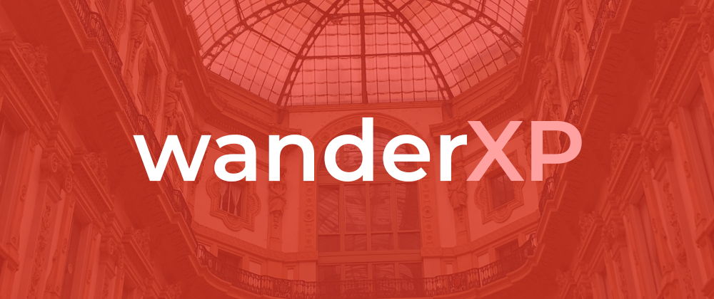
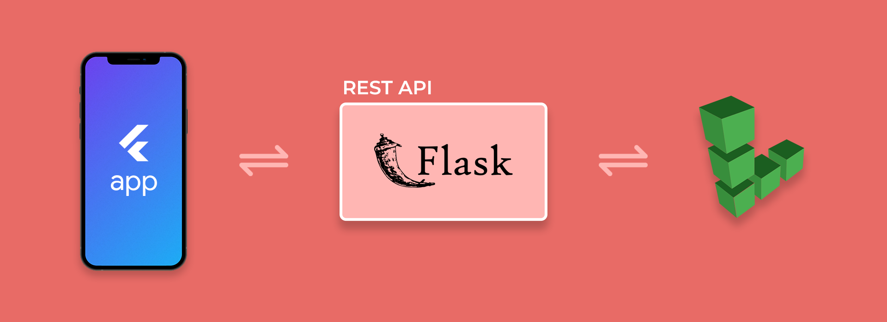
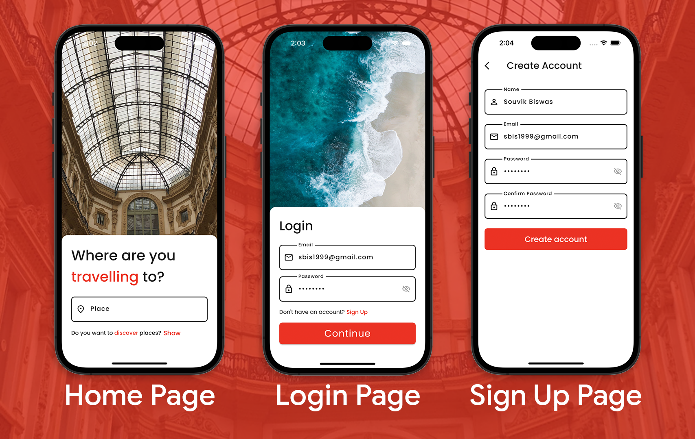
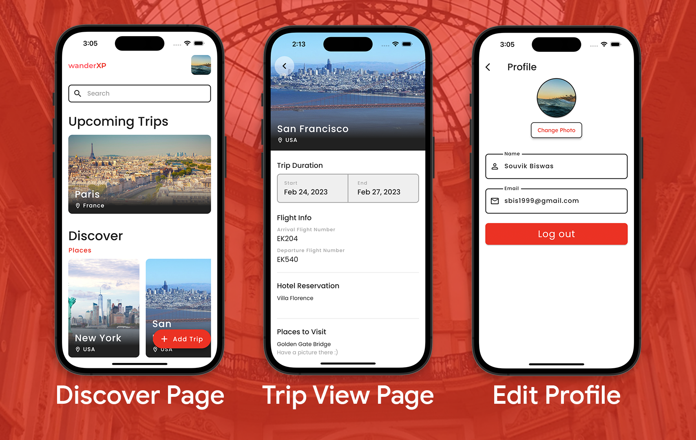
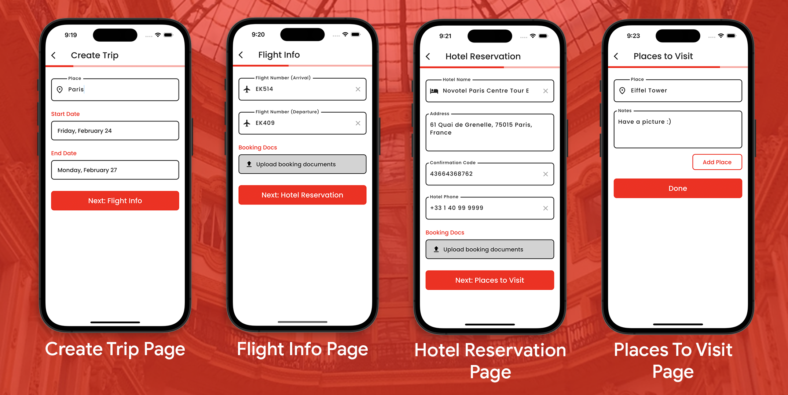

# WanderXP

> Blog post about this project: https://dev.to/sbis04/wanderxp-organize-your-travel-with-ease-205d
>
> Try out the app (Android): https://appdistribution.firebase.dev/i/a0b42613bd16e37e
> 
> Try out the app (Web): https://wanderxp.flutterflow.app

**WanderXP** helps you to keep your travel requirements organized including flight and hotel details, and the notable places that you don't want to miss visiting.

## Architecture

Here's an overview of the entire architecture of the cross-platform application along with the backend infrastructure built with Flask and managed on Linode:

The tech stack used for building this project:

* [**FlutterFlow**](https://flutterflow.io): It's a no-code platform that I have used for designing the app from scratch, connecting with the REST API, and then generating the source code in Flutter.

* [**Flask**](https://flask.palletsprojects.com/en/2.2.x): Used for building the REST API to manage user authentication, database CRUD operations, and storing files.

* [**Linode**](https://www.linode.com): For getting access to the cloud computing infrastructure along with their managed database (SQL) and object storage.

## Screenshots

### License

Copyright (c) 2023 Souvik Biswas

Permission is hereby granted, free of charge, to any person obtaining a copy
of this software and associated documentation files (the "Software"), to deal
in the Software without restriction, including without limitation the rights
to use, copy, modify, merge, publish, distribute, sublicense, and/or sell
copies of the Software, and to permit persons to whom the Software is
furnished to do so, subject to the following conditions:

The above copyright notice and this permission notice shall be included in all
copies or substantial portions of the Software.

THE SOFTWARE IS PROVIDED "AS IS", WITHOUT WARRANTY OF ANY KIND, EXPRESS OR
IMPLIED, INCLUDING BUT NOT LIMITED TO THE WARRANTIES OF MERCHANTABILITY,
FITNESS FOR A PARTICULAR PURPOSE AND NONINFRINGEMENT. IN NO EVENT SHALL THE
AUTHORS OR COPYRIGHT HOLDERS BE LIABLE FOR ANY CLAIM, DAMAGES OR OTHER
LIABILITY, WHETHER IN AN ACTION OF CONTRACT, TORT OR OTHERWISE, ARISING FROM,
OUT OF OR IN CONNECTION WITH THE SOFTWARE OR THE USE OR OTHER DEALINGS IN THE
SOFTWARE.
